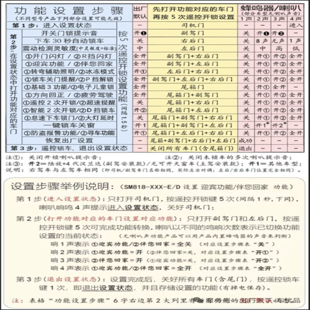

<div align="center" style="text-align: center;">



<h1>FRIDAY</h1>

<p>
  <b>FRIDAY is a premium, highly-customized personal AI assistant fork of openpilot.</b>
  <br>
  Designed to deliver a refined driving experience, FRIDAY upgrades the driver assistance system in 300+ supported cars with a custom UI theme, advanced Toyota control tuning, drive telemetry, and local hardware diagnostics.
</p>

<h3>
  <a href="#-key-features">Key Features</a>
  <span> · </span>
  <a href="#-installation">Installation</a>
  <span> · </span>
  <a href="#-supported-vehicles">Supported Vehicles</a>
  <span> · </span>
  <a href="#%EF%B8%8F-developer-guide">Developer Guide</a>
  <span> · </span>
  <a href="https://discord.comma.ai">Community</a>
</h3>

[](LICENSE)
[](https://github.com/sindresorhus/awesome)
[](https://github.com/nnnc8/openpilot)

---

</div>

FRIDAY is a customized fork built to improve daily drivability, safety, and visual aesthetics. Inspired by other leading forks such as *sunnypilot* and *frogpilot*, it merges advanced control state machines, localization improvements, and telemetry monitoring into a clean, unified platform.

---

## 🎨 Key Features

### 1. Visual Aesthetics & Theming
FRIDAY completely revamps the stock openpilot interface with a premium design language:
* **Zandvoort Blue Theme:** A beautifully unified accent color palette applied across all offroad and onroad settings panels.
* **Tesla-Inspired Dashboard UI:** Clean, modern drive dashboards featuring custom vehicle models and transparent FSD status markers.
* **Cubic 11 Font Integration:** Standard system fonts are replaced with [Cubic 11 (立方 11)](https://github.com/AkiCode/cubic-11) for crisp, beautiful Traditional Chinese and English text legibility.
* **Tabler Icons:** Over 70 customized vector SVG icons integrated throughout the settings panels.

### 2. Advanced Toyota Optimization & Safety Gates
Tuned for safety, smoothness, and responsiveness:
* **Toyota Brake Hold v2:** A custom state machine for automatic brake hold that prevents manual override lockouts and supports smooth resume transitions.
* **AEB Safety Gate:** Safety interlock that automatically gates and disables custom brake hold commands during Autonomous Emergency Braking (AEB) activations.
* **Scene Acceleration Presets:** Quick-select presets tailored to specific driving environments (e.g., highway, city, heavy traffic) that optimize ACC response profiles.
* **Corolla TSS2 Dynamic Follow Tune:** Tighter, more responsive headways specifically optimized for Corolla TSS2 platforms to prevent aggressive cut-ins.

### 3. Drive Telemetry & Journey Board v2
Keep track of your driving statistics directly from the device:
* **Journey Board v2:** A telemetry dashboard that replaces legacy achievements with pure drive statistics.
* **Active Assist Metrics:** Tracks real-time steering/pedal assist ratios and mileage.
* **Localized Layouts:** Clean layouts with full Traditional Chinese (`zh-CHT`) and Simplified Chinese (`zh-CHS`) translation support.

### 4. Quiet Cabin & Audio Control
* **Quiet Cabin v1:** Suppresses repetitive and unnecessary vehicle alert beeps (e.g., lane warnings, TSS feedback beeps) for a quieter, more comfortable passenger cabin.
* **Custom Acoustic Feedback:** Automatic brake hold activation triggers are coupled with premium audio prompts (e.g., BMW Bong).
* **Beep Safety Audit:** Features full CAN signal audits for idle door locking and beep suppression.

### 5. Diagnostics & Health Monitor
* **FRIDAY Health Center:** An active diagnostic daemon (`aegis_healthd`) monitoring CPU temperatures, voltage spikes, and local hardware aging.
* **Web Diagnostic Portal:** Fully integrated with the local web manager to view hardware statuses remotely.

### 6. Web Manager (Fleet Manager) Optimizations
* **Optimized Mobile Route Viewer:** Ported from `dev-c3`, featuring a fluid, responsive UI tailored for mobile screens.
* **Fast Disk Summary:** Restricted directory depth scans reduce disk read amplification and accelerate list load times.

---

## 💾 Installation

### Hardware Compatibility
FRIDAY is designed and optimized specifically for the **comma 3 / 3X** hardware.

### Installation Steps
1. Perform a factory reset or choose custom software installation on your comma device.
2. When prompted for the software URL, enter:
   ```text
   https://installer.comma.ai/nnnc8/top-c3
   ```
3. Follow the on-screen instructions to complete the installation and reboot your device.

---

## 🚗 Supported Vehicles

FRIDAY inherits support for **over 300+ vehicles** from stock openpilot. Additionally, it offers deep, customized integration for Toyota and Lexus models equipped with Toyota Safety Sense (TSS2 / TSS-P).

* Refer to [CARS.md](docs/CARS.md) for the complete list of supported vehicles.
* Refer to [FORK_AUDIT.md](docs/FORK_AUDIT.md) for audit logs of experimental features borrowed from sunnypilot, frogpilot, and dragonpilot.

---

## 🛠️ Developer Guide

We welcome contributions and community improvements.

### Development Environment Setup
To get started with developing FRIDAY locally:
```bash
git clone https://github.com/nnnc8/openpilot.git
cd openpilot
git checkout top-c3
```

Ensure you have your environment variables set up, and run compilation tests:
```bash
scons -j$(nproc)
```

### Run Stability Check
Verify code format and run the local sanity checks:
```bash
pytest selfdrive/selfdrived/tests/test_toyota_presets_selfdrived.py
pytest common/tests/test_aegis_journey_board.py
```

---

## ⚖️ Safety & Licensing

* **Safety Compliance:** FRIDAY maintains openpilot's ISO26262 safety guidelines and compiles safety parameters into the panda firmware. See [SAFETY.md](docs/SAFETY.md) for more details.
* **Licensing:** FRIDAY is released under the **MIT License**. The [Cubic 11](selfdrive/assets/fonts/Cubic_11_OFL.txt) font is licensed under the SIL Open Font License (OFL).

---

> [!WARNING]
> **FRIDAY IS ALPHA QUALITY SOFTWARE FOR RESEARCH PURPOSES ONLY.**
> It is not a certified consumer product. You are entirely responsible for complying with local traffic laws and driving safety regulations. Always keep your hands on the wheel and remain ready to take over manual control at any moment.
